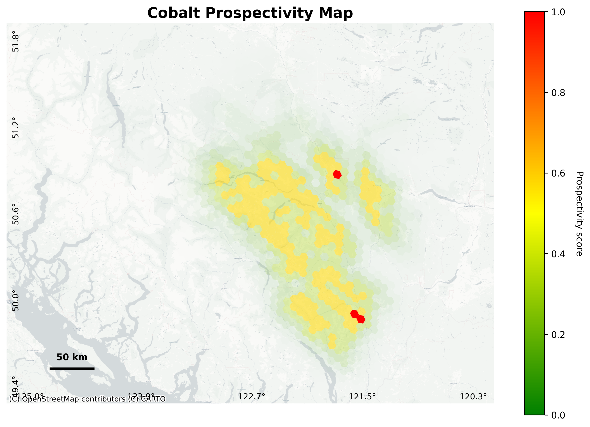

# Prospectivity Tools

This repository contains a geospatial prospectivity heatmap generator built using
H3 hexagonal grids, basic fuzzy logic, and a configurable pipeline. It ingests bedrock geology polygons, indexes them with H3, computes distances to interfaces between two serpentine/ultramafic rock and granodiorite using native H3 functions on the indexed data, applies a Gaussian fall‑off scoring function, and produces a prospectivity score for each H3 cell. The results are saved as a geopackage file and a static map visualization.

## Structure

- **`config.yaml`** – all adjustable parameters: coordinate reference system,
  rock type names, fall‑off distance, gaussian shape factor, relative influence weight of the rock types, H3 resolution, output paths.
- **`src/`** – modular Python code for ingestion, geospatial functions, scoring,visualization and a CLI entrypoint.
- **`notebooks/`** – Jupyter notebook with detailed explanation of the data and methods exploration underpinning the package development.
- **`data/`** – raw input data (e.g. `BedrockP.gpkg`) and processed outputs.
- **`tests/`** – simple unit tests for the scoring module.

## Getting Started

1. Install dependencies declared in `pyproject.toml` into a virtual
   environment:

   ```bash
   python -m venv .venv && source .venv/bin/activate
   pip install -e .
    ```

    Alternatively, you can use `uv` as described below.

2. Place your `BedrockP.gpkg` file into `data/raw/` and adjust `config.yaml`
   as needed to select different rock types or H3 resolutions.

3. Run the pipeline via the CLI:

   ```bash
   prospectivity
   ```

   This generates a geopackage file of H3 cell scores at `data/processed/prospectivity_scores.gpkg` and saves a static map visualization in `data/processed/prospectivity.png`.

   **CLI Options:**
   - `--generate-map/--no-generate-map`: Generate static map visualization (default: True)
   - `--config`: Path to configuration file (default: config.yaml)

### Development environment with `uv`

`uv` can be used to create a reproducible environment with all development
dependencies included:

```bash
uv venv
uv pip install -e .[dev]
```

If you are working in Jupyter, ensure the kernel points to this environment so
that notebooks can `import prospectivity_tools` without issues.

## Approach

A detailed look at the data and methods exploration underpinning this package is provided in `notebooks/initial_data_exploration.ipynb`. This notebook explores the data source, the feature engineering approach, and the choice to use the fuzzy logic overlay method for prospectivity scoring. Here is the summary of the approach:

**Package development**: Functions were designed to be modular and reusable for future projects

**Lithography classification**: The classification of rock types was performed by searching for the words "serpentite", "ultramafic", and "granodiorite" across the rock_type, rock_class, and unit_desc columns

**Geospatial methods**: The H3 library was used for efficient spatial indexing and distance calculations. This is probably a less common approach in geology; I made this choice to give this project my own personal touch. Distance calculations are performed on a geospatially-naive dataframe, as the H3 library provides a framework for working with hexagonal grids and distance calculations without needing to convert to a geospatial dataframe.

**Scoring**: A "fuzzy AND" approach was used to combine the distances to the two rock types. The scoring function applies a Gaussian fall-off based on the distance to the interfaces, with a configurable shape factor and maximum distance. The scoring function is designed to be flexible and additionally allows for weighting the influence of each rock type, though for the submitted heatmap the two rock types are treated equally.

## Heatmap



## Future Work

- Improve static map generation time (currently it's slow but looks great)
- Implement a more sophisticated fuzzy logic overlay method that incorporates additional geological features
- Validate spatial modeling results with field data to generate AUC scores
- (If needed) move geospatial analysis to SQL database for better performance and scalability

## References

- Nykänen, V., Törmänen, T. & Niiranen, T. (2023). Cobalt Prospectivity Using a Conceptual Fuzzy Logic Overlay Method Enhanced with the Mineral Systems Approach. *Nat Resour Res*, 32, 2387–2416. https://doi.org/10.1007/s11053-023-10255-8
- L.A. Zadeh, Fuzzy sets, Information and Control, 8 (1965) 338-353.
- Bonham-Carter , G. F. 1994 . Geographic Information Systems for Geoscientists Modelling with GIS , New York : Pergamon Press . (Computer Methods in the Geosciences)
- Geoscience BC Report 2013-13: [GBC_Report2013-13.pdf](https://cdn.geosciencebc.com/project_data/GBC_Report2013-13/GBC_Report2013-13.pdf)
- BCGS Open File 2017-08: [BCGS_OF2017-08.pdf](https://cmscontent.nrs.gov.bc.ca/geoscience/PublicationCatalogue/OpenFile/BCGS_OF2017-08.pdf)
- [H3 Documentation](https://h3geo.org/docs/)
